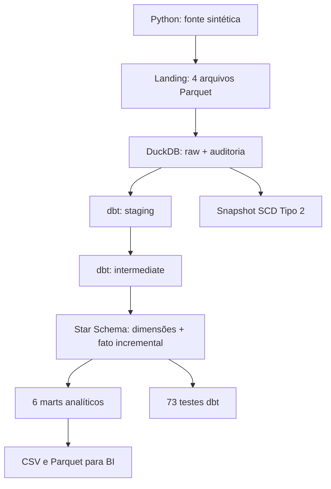
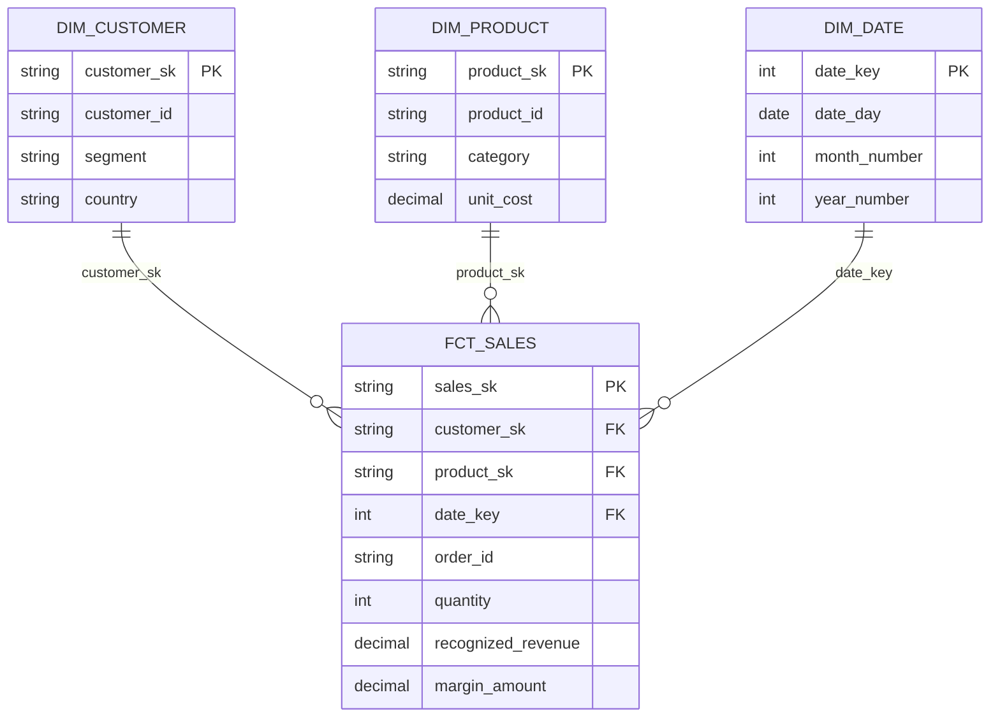

# Sales Analytics Data Pipeline

[](https://github.com/Victorvanzella/Sales-Analytics-Data-Pipeline/actions/workflows/ci.yml)


Projeto completo de Analytics Engineering que transforma fontes transacionais de vendas em um warehouse dimensional pronto para BI. Python gera e ingere dados em Parquet, DuckDB armazena as camadas analíticas e dbt executa transformações SQL, carga incremental, testes, documentação e lineage.

> O projeto roda localmente sem credenciais ou infraestrutura externa. Os dados são sintéticos, determinísticos e não contêm informações pessoais reais.

## Resultado comprovado

A execução padrão foi validada de ponta a ponta com os seguintes resultados:

| Métrica | Resultado |
|---|---:|
| Clientes | 5.000 |
| Produtos | 100 |
| Pedidos | 50.000 |
| Itens na tabela fato | 92.398 |
| Unidades processadas | 167.866 |
| Dias na dimensão calendário | 731 |
| Receita reconhecida | R$ 30.925.200,35 |
| Margem reconhecida | R$ 12.088.814,24 |
| Objetos dbt no warehouse | 17 |
| Testes dbt aprovados | 73/73 |
| Testes Python aprovados | 28/28 |
| Cobertura dos testes Python | 92,57% |
| Verificações finais | 9/9 |

Esses números são produzidos pelo próprio pipeline e registrados em `reports/pipeline_metrics.json`.

## Problema de negócio

Arquivos operacionais de clientes, produtos, pedidos e itens não têm o formato adequado para dashboards. Consultas diretas sobre essas fontes misturam regras de negócio, repetem cálculos e dificultam a reconciliação financeira.

O pipeline resolve esse cenário ao:

1. gerar fontes relacionais coerentes e reproduzíveis;
2. carregá-las na camada `raw` com auditoria e checksum;
3. padronizar tipos e nomes na camada `staging`;
4. enriquecer e reconciliar os dados na camada `intermediate`;
5. publicar um Star Schema e marts orientados a decisões;
6. bloquear a entrega quando testes ou reconciliações falham.

## Arquitetura



## Diferenciais implementados

- quatro fontes normalizadas: clientes, produtos, pedidos e itens;
- arquivos Parquet com checksum SHA-256 e manifesto de execução;
- warehouse DuckDB com schemas `raw`, `audit`, `staging`, `intermediate`, `marts`, `reference` e `snapshots`;
- transformações SQL modulares com dbt;
- Star Schema com três dimensões e uma tabela fato;
- `fct_sales` incremental com chave única e watermark de atualização;
- snapshot de clientes para histórico SCD Tipo 2;
- seed versionada com metas de participação por país;
- seis marts para consumo de BI;
- testes de unicidade, nulidade, domínio, relacionamento e reconciliação;
- source freshness para detectar fontes desatualizadas;
- auditoria por `run_id`, logs e métricas operacionais;
- exportação simultânea em CSV e Parquet/ZSTD;
- Docker, Makefile e GitHub Actions;
- documentação gerada automaticamente pelo dbt.

## Modelo dimensional



O grão de `fct_sales` é **um item de pedido**. Isso permite analisar receita, margem, produto, cliente, data, canal, pagamento, país e status sem dupla contagem.

## Camadas dbt

| Camada | Materialização | Responsabilidade |
|---|---|---|
| `raw` | tabelas DuckDB | cópia auditável das fontes Parquet |
| `staging` | views | tipos, nomes e domínios padronizados |
| `intermediate` | views | joins e cálculos financeiros reutilizáveis |
| `marts` | tabelas | dimensões, fato incremental e indicadores |
| `snapshots` | snapshot dbt | histórico de alterações de clientes |
| `reference` | seed dbt | metas versionadas do negócio |

## Marts publicados

| Modelo | Consumidor e finalidade |
|---|---|
| `mart_daily_sales` | evolução diária de pedidos, receita e devoluções |
| `mart_monthly_sales` | tendência mensal, margem e clientes ativos |
| `mart_category_performance` | desempenho de categorias e subcategorias |
| `mart_customer_360` | valor, frequência, recência e tier do cliente |
| `mart_channel_performance` | comparação de canais e pagamentos |
| `mart_country_performance` | participação de receita versus meta por país |

## Como executar

### Windows PowerShell

```powershell
git clone https://github.com/Victorvanzella/Sales-Analytics-Data-Pipeline.git
cd Sales-Analytics-Data-Pipeline
py -3.12 -m venv .venv
.venv\Scripts\Activate.ps1
python -m pip install -r requirements-dev.txt
python -m src.pipeline --full-refresh
python -m src.verify_outputs
```

### Linux ou macOS

```bash
git clone https://github.com/Victorvanzella/Sales-Analytics-Data-Pipeline.git
cd Sales-Analytics-Data-Pipeline
python3.12 -m venv .venv
source .venv/bin/activate
python -m pip install -r requirements-dev.txt
python -m src.pipeline --full-refresh
python -m src.verify_outputs
```

Ao finalizar, o terminal apresenta:

```text
Pipeline concluida: 50000 pedidos, 92398 itens e 73 testes dbt aprovados.
Verificacao concluida: 9 checks aprovados.
```

## Execução com Docker

```bash
docker compose run --rm pipeline
```

Os diretórios `data`, `reports` e `logs` são montados como volumes para que as saídas permaneçam no computador.

## Comandos úteis

```bash
# Executa carga incremental depois da primeira execução
python -m src.pipeline

# Reconstrói modelos incrementais desde o início
python -m src.pipeline --full-refresh

# Altera o volume e a seed
python -m src.pipeline --customers 1000 --products 50 --orders 10000 --seed 123

# Executa apenas os testes dbt
dbt build --profiles-dir .

# Gera e abre a documentação/lineage local do dbt
dbt docs generate --profiles-dir .
dbt docs serve --profiles-dir .

# Executa testes Python e cobertura
pytest --cov=src --cov-report=term-missing

# Remove apenas artefatos reproduzíveis
python -m src.clean_outputs
```

Também estão disponíveis `make pipeline`, `make verify`, `make test`, `make lint` e `make docs`.

## Testes de dados

Os 73 testes dbt incluem:

- chaves únicas e obrigatórias;
- integridade entre pedidos, clientes, produtos e itens;
- relacionamentos da tabela fato com todas as dimensões;
- valores aceitos para status, segmento e tier;
- reconciliação do valor de cada item;
- igualdade entre o grão da fonte e o grão da tabela fato;
- ausência de métricas financeiras negativas;
- reconciliação de receita entre fato e mart diário;
- garantia de que todo pedido possui ao menos um item.

Os 28 testes Python cobrem geração, determinismo, integridade referencial, manifesto, ingestão, auditoria, execução dbt, exportações, métricas, limpeza segura e verificação final.

## Saídas

| Caminho | Conteúdo |
|---|---|
| `data/source/*.parquet` | fontes sintéticas normalizadas |
| `data/source/manifest.json` | contagens, seed e checksums |
| `data/warehouse/sales_analytics.duckdb` | warehouse completo |
| `data/exports/*.csv` | marts para ferramentas tradicionais |
| `data/exports/*.parquet` | marts colunares comprimidos |
| `reports/pipeline_metrics.json` | métricas técnicas e de negócio |
| `reports/verification_report.json` | nove checks finais |
| `logs/pipeline.log` | eventos e falhas por `run_id` |
| `target/manifest.json` | lineage e metadados dbt |
| `target/run_results.json` | resultado detalhado dos testes dbt |

Esses artefatos são reproduzíveis e, por isso, não são versionados no Git.

## Estrutura do repositório

```text
.
├── .github/workflows/ci.yml
├── analyses/
├── data/
│   ├── source/
│   ├── warehouse/
│   └── exports/
├── dbt_tests/
├── docs/
├── macros/
├── models/
│   ├── staging/
│   ├── intermediate/
│   └── marts/
├── seeds/
├── snapshots/
├── src/
├── tests/
├── dbt_project.yml
├── profiles.yml
├── Dockerfile
└── compose.yml
```

## GitHub Actions

A CI executa a cada push e pull request:

1. instalação reproduzível das dependências;
2. lint e formatação Python;
3. 28 testes Python com cobertura mínima de 85%;
4. pipeline completo com 5.000 pedidos;
5. 73 testes dbt e nove verificações finais;
6. geração da documentação dbt;
7. publicação temporária dos relatórios, logs e metadados como artefato.

## Decisões técnicas

### Por que DuckDB?

DuckDB é um banco OLAP embutido, rápido para processamento analítico e compatível com Parquet. Ele permite demonstrar SQL, dbt, Star Schema e testes de dados sem exigir que o avaliador configure servidor, usuário ou senha. O mesmo projeto pode ser adaptado para PostgreSQL, BigQuery, Snowflake ou Databricks trocando o adapter e revisando o SQL específico.

### Por que Parquet?

Parquet preserva tipos, reduz o tamanho dos arquivos e representa melhor uma camada de landing analítica que CSV. Os marts também são exportados em CSV para compatibilidade com Excel e Power BI.

### Receita reconhecida

Somente pedidos com status `Delivered` entram em `recognized_revenue`. Pedidos enviados ou em processamento continuam disponíveis na fato, mas não antecipam receita. Devoluções são registradas separadamente em `returned_amount`.

### Incrementalidade

`fct_sales` utiliza `order_item_id` como chave única e `source_updated_at` como watermark. A opção `--full-refresh` recria o modelo; sem ela, o dbt processa somente registros com atualização posterior à maior data já carregada.

## Documentação técnica

- [Arquitetura e decisões](docs/architecture.md)
- [Modelo dimensional](docs/data_model.md)
- [Catálogo de métricas](docs/metrics_catalog.md)
- [Runbook operacional](docs/runbook.md)

## Limitações e evolução

O pipeline representa um ambiente analítico local em lote. Em produção, as evoluções naturais seriam armazenamento em objeto, orquestração agendada, ingestão CDC, adapter para cloud warehouse, controle de acesso, alertas e publicação dos marts em uma ferramenta de BI.

## Origem

O repositório começou como uma proposta acadêmica de análise de vendas com Pandas. Esta versão reconstrói o projeto como uma plataforma de Analytics Engineering executável, com modelagem dimensional, SQL modular, incrementalidade, histórico, testes e observabilidade.

## Licença

Distribuído sob a licença MIT. Consulte [LICENSE](LICENSE).
