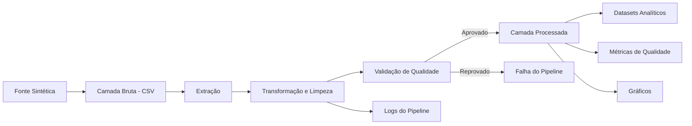

# Pipeline de Qualidade de Dados para E-Commerce


Pipeline de qualidade de dados para vendas de e-commerce desenvolvido com **Python e Pandas**.

O projeto transforma dados transacionais brutos e inconsistentes em uma camada processada, validada e pronta para análise, demonstrando fundamentos importantes para uma posição de **Engenharia de Dados Júnior**: ingestão, transformação, qualidade de dados, observabilidade, testes automatizados, modularização e integração contínua.

> O problema de negócio e as regras-base de limpeza foram inspirados no Mini-Projeto 4 do curso **Fundamentos de Linguagem Python - Do Básico a Aplicações de IA**, da Data Science Academy. A arquitetura do pipeline, modularização, validações, métricas, logs, testes e CI foram desenvolvidos como evolução de portfólio.

---

## Problema de Negócio

Uma empresa de e-commerce coleta dados de pedidos, clientes, produtos e entregas, mas sua camada bruta apresenta problemas que tornam os relatórios pouco confiáveis.

O conjunto de dados simula:

- valores ausentes;
- registros duplicados;
- preços armazenados como texto;
- valor inválido em preço;
- identificadores de cliente com tipo incorreto;
- outlier de quantidade;
- ausência de status de entrega.

O objetivo do pipeline é criar uma camada de dados **confiável, reproduzível e validada** para consumo analítico.

---

## Arquitetura



### Fluxo dos Dados

```text
Fonte Sintética
       |
       v
data/raw/sales_raw.csv
       |
       v
    Extração
       |
       v
Normalização de tipos
Tratamento de valores ausentes
Remoção de duplicatas
Tratamento de outliers
Engenharia de atributos
       |
       v
Validação de qualidade
       |
       v
data/processed/sales_clean.csv
       |
       +------> Datasets analíticos
       +------> Relatório de qualidade
       +------> Métricas do pipeline
       +------> Gráficos
       +------> Logs
```

---

## Regras de Qualidade de Dados

| Regra | Problema na camada bruta | Ação do pipeline |
|---|---|---|
| `Quantidade` ausente | Valores numéricos ausentes | Preenchimento pela mediana |
| `Status_Entrega` ausente | Categoria ausente | Preenchimento pela moda |
| `Preco_Unitario` inválido | Texto como `valor_invalido` | Conversão para nulo e remoção da linha crítica |
| `Cliente_ID` ausente/inválido | Cliente não identificável | Remoção da linha crítica |
| Registros duplicados | Pode inflar a receita | Remoção de duplicatas |
| Outlier de quantidade | Distorce as análises | Remoção acima de média + 3 desvios padrão |
| Status de entrega inválido | Valor fora do domínio esperado | Falha na validação |
| Preço ou quantidade menor ou igual a zero | Valor de negócio inválido | Falha na validação |

A camada processada só é publicada após todas as regras de validação serem aprovadas.

---

## Estrutura do Projeto

```text
E-Commerce-Data-Quality-Pipeline/
├── .github/
│   └── workflows/
│       └── ci.yml
├── data/
│   ├── raw/
│   │   └── sales_raw.csv
│   └── processed/
│       └── sales_clean.csv
├── docs/
│   ├── data_dictionary.md
│   └── technical_decisions.md
├── logs/
│   └── pipeline.log
├── reports/
│   ├── charts/
│   ├── daily_sales.csv
│   ├── data_quality_report.json
│   ├── delivery_status.csv
│   ├── pipeline_metrics.json
│   ├── product_summary.csv
│   └── revenue_by_category.csv
├── src/
│   ├── __init__.py
│   ├── analytics.py
│   ├── config.py
│   ├── data_quality.py
│   ├── extract.py
│   ├── generate_data.py
│   ├── pipeline.py
│   ├── transform.py
│   └── visualize.py
├── tests/
│   ├── test_data_quality.py
│   ├── test_generate_data.py
│   └── test_transform.py
├── .gitignore
├── LICENSE
├── Makefile
├── pyproject.toml
├── README.md
└── requirements.txt
```

---

## Etapas do Pipeline

### 1. Geração da Fonte

Arquivo: `src/generate_data.py`

Cria o conjunto de dados sintético utilizando uma semente aleatória fixa, garantindo reprodutibilidade.

O dataset contém propositalmente erros e inconsistências para simular um cenário real de qualidade de dados.

### 2. Extração

Arquivo: `src/extract.py`

Carrega o CSV bruto e verifica se todas as colunas obrigatórias estão presentes antes do processamento.

### 3. Transformação

Arquivo: `src/transform.py`

Executa:

- normalização de tipos;
- tratamento de valores ausentes;
- remoção de linhas com campos críticos inválidos;
- remoção de duplicatas;
- tratamento de outliers;
- engenharia de atributos;
- conversão final dos tipos;
- ordenação determinística dos registros.

É criada a coluna:

```text
Total_Venda = Quantidade × Preco_Unitario
```

### 4. Validação

Arquivo: `src/data_quality.py`

A camada processada precisa atender a um conjunto mínimo de regras de qualidade.

As validações incluem:

- pedidos únicos;
- ausência de valores nulos;
- status de entrega válidos;
- quantidades positivas;
- preços positivos;
- tipos de dados corretos;
- valor total de venda não negativo.

### 5. Publicação

Quando as validações são aprovadas, o pipeline gera:

- dataset limpo;
- datasets analíticos;
- relatório de qualidade;
- métricas de execução;
- gráficos;
- logs.

Caso alguma validação falhe, o pipeline interrompe a execução para impedir a publicação de dados inválidos.

---

## Como Executar

### 1. Clonar o repositório

```bash
git clone https://github.com/Victorvanzella/E-Commerce-Data-Quality-Pipeline-Python-Pandas.git
cd E-Commerce-Data-Quality-Pipeline-Python-Pandas
```

### 2. Criar ambiente virtual

```bash
python -m venv .venv
```

Windows:

```bash
.venv\Scripts\activate
```

Linux/macOS:

```bash
source .venv/bin/activate
```

### 3. Instalar dependências

```bash
pip install -r requirements.txt
```

### 4. Executar o pipeline

```bash
python -m src.pipeline
```

Ou:

```bash
make run
```

### 5. Executar os testes

```bash
pytest -q
```

Ou:

```bash
make test
```

---

## Testes Automatizados

O projeto inclui testes automatizados para:

- garantir reprodutibilidade da geração dos dados;
- validar remoção de duplicatas;
- validar criação da coluna `Total_Venda`;
- testar tratamento de valores críticos inválidos;
- validar regras de qualidade da camada processada;
- verificar detecção de pedidos duplicados.

O GitHub Actions executa os testes e o pipeline automaticamente em pushes e pull requests.

---

## Observabilidade

O pipeline não apenas transforma dados: ele também registra o que ocorreu durante a execução.

### Logs

```text
logs/pipeline.log
```

Registra o início, etapas, falhas e conclusão do pipeline.

### Relatório de Qualidade

```text
reports/data_quality_report.json
```

Contém:

- perfil da camada bruta;
- perfil da camada processada;
- tipos de dados;
- quantidade de valores nulos;
- quantidade de duplicatas;
- resultado das validações;
- métricas das transformações.

### Métricas do Pipeline

```text
reports/pipeline_metrics.json
```

Contém:

- quantidade de linhas de entrada;
- quantidade de linhas de saída;
- registros removidos;
- valores imputados;
- duplicatas removidas;
- outliers removidos;
- faturamento total;
- número de pedidos;
- número de clientes;
- produto e categoria de maior destaque.

---

## Resultados do Pipeline

A execução validada desta versão apresentou:

| Métrica | Resultado |
|---|---:|
| Registros brutos | 103 |
| Registros processados | 97 |
| Registros removidos | 6 |
| Valores ausentes de `Quantidade` preenchidos | 6 |
| Valores ausentes de `Status_Entrega` preenchidos | 3 |
| Linhas críticas inválidas removidas | 2 |
| Registros duplicados removidos | 3 |
| Outliers de quantidade removidos | 1 |
| Pedidos únicos finais | 97 |
| Clientes únicos | 45 |
| Faturamento total | R$ 928.869,00 |
| Produto líder em unidades | Smartphone |
| Produto líder em receita | Smartphone |
| Categoria líder em receita | Eletrônicos |
| Testes automatizados | 5 aprovados |

Esses resultados comprovam que as regras de transformação e qualidade foram realmente executadas pelo pipeline.

---

## Saídas Analíticas

A camada processada gera datasets reutilizáveis:

- `revenue_by_category.csv`
- `product_summary.csv`
- `daily_sales.csv`
- `delivery_status.csv`

A lógica analítica fica separada do processamento principal, permitindo que os arquivos sejam consumidos futuramente por dashboards ou outras aplicações.

---

## Visualizações

### Receita por Categoria


### Quantidade Vendida por Produto


### Tendência de Vendas Diárias


---

## Decisões de Engenharia

O projeto evita adicionar tecnologias apenas para aumentar a quantidade de palavras-chave no currículo.

CSV e Pandas são suficientes para demonstrar o objetivo principal deste projeto:

**construção de um pipeline de transformação e qualidade de dados.**

As decisões técnicas estão documentadas em:

[`docs/technical_decisions.md`](docs/technical_decisions.md)

O dicionário de dados está disponível em:

[`docs/data_dictionary.md`](docs/data_dictionary.md)

---

## Competências Demonstradas

- Python
- Pandas
- NumPy
- fundamentos de ETL
- limpeza de dados
- transformação de dados
- qualidade de dados
- validação de schema
- engenharia de atributos
- logging
- observabilidade de dados
- testes automatizados com Pytest
- GitHub Actions / CI
- organização modular
- documentação técnica
- pipelines reproduzíveis

---

## Próximas Evoluções

Possíveis evoluções futuras:

1. substituir a camada processada em CSV por PostgreSQL;
2. criar modelos analíticos em SQL;
3. adicionar Docker;
4. adicionar orquestração com Airflow;
5. utilizar uma biblioteca dedicada de qualidade de dados;
6. publicar a camada processada em armazenamento de objetos na nuvem.

Essas melhorias são apresentadas como evolução futura para não adicionar complexidade sem necessidade arquitetural.

---

## Origem Acadêmica

O projeto surgiu a partir do cenário de negócio e das regras de limpeza apresentadas no **Mini-Projeto 4 da Data Science Academy: Limpeza, Engenharia de Atributos e Análise Exploratória de Dados de Vendas com Pandas**.

A versão de portfólio reorganiza o exercício em um pipeline reutilizável e adiciona práticas de Engenharia de Dados que não eram o foco principal do notebook original.

---

## Autor

**Victor Vanzella**

Projeto de portfólio focado em Engenharia de Dados.
